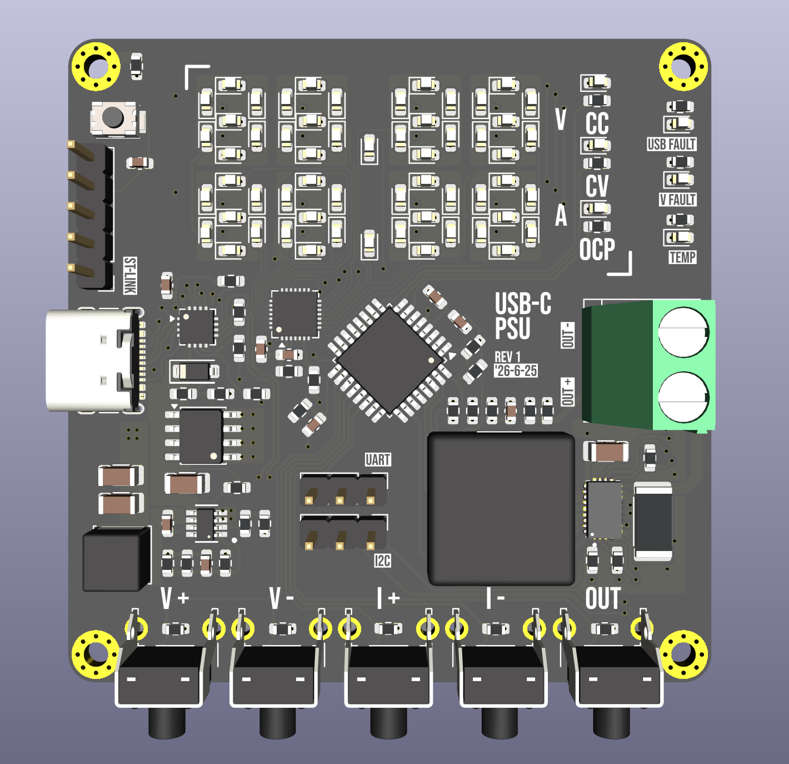
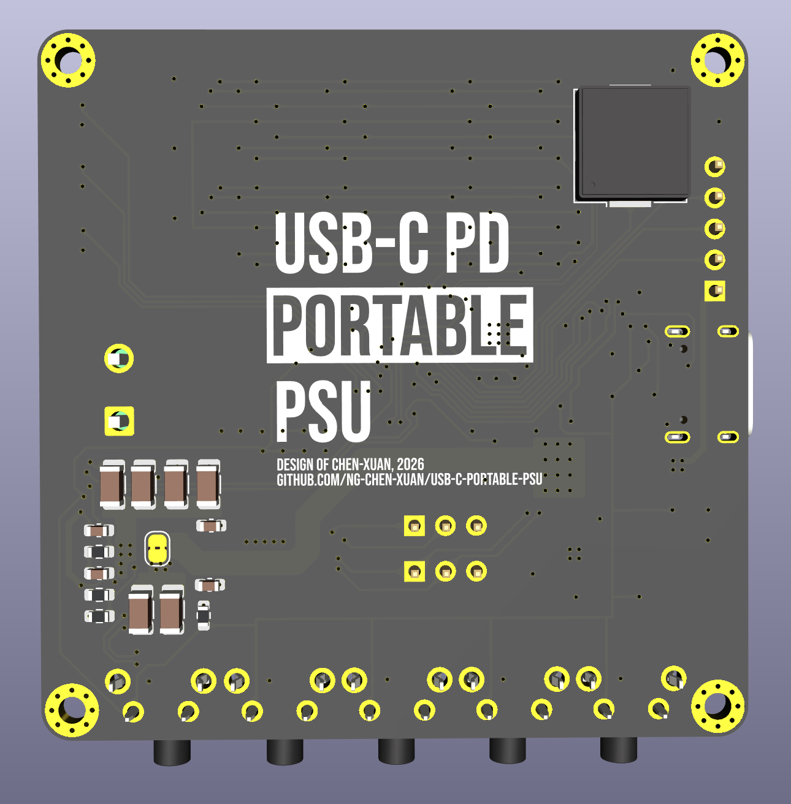
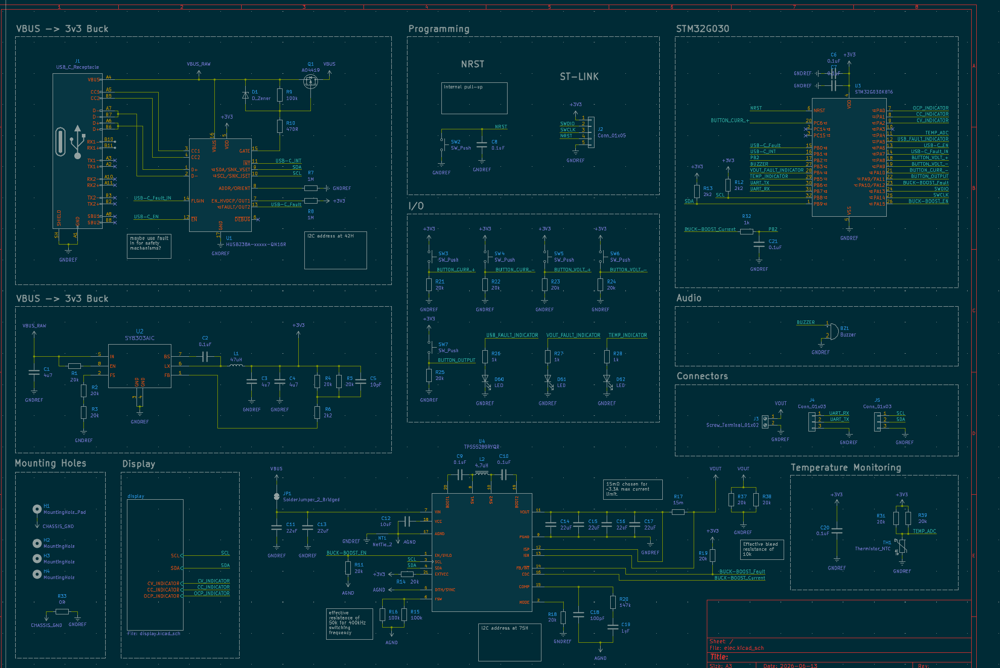
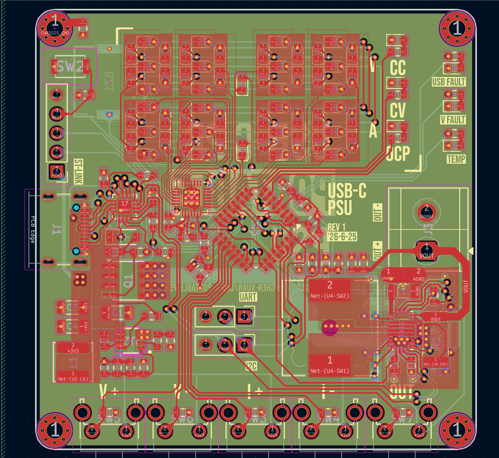
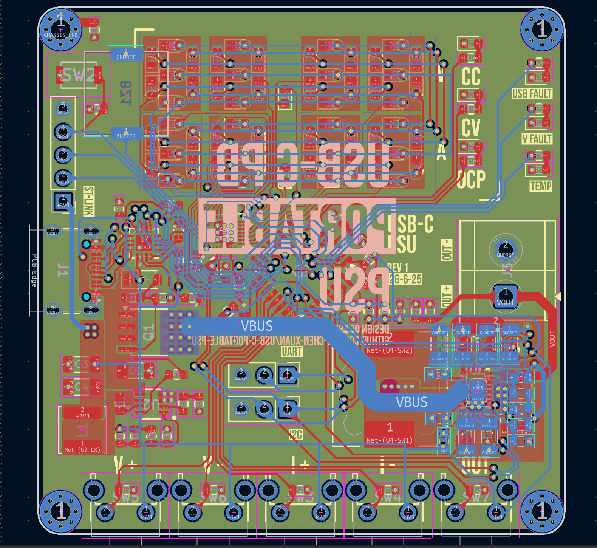
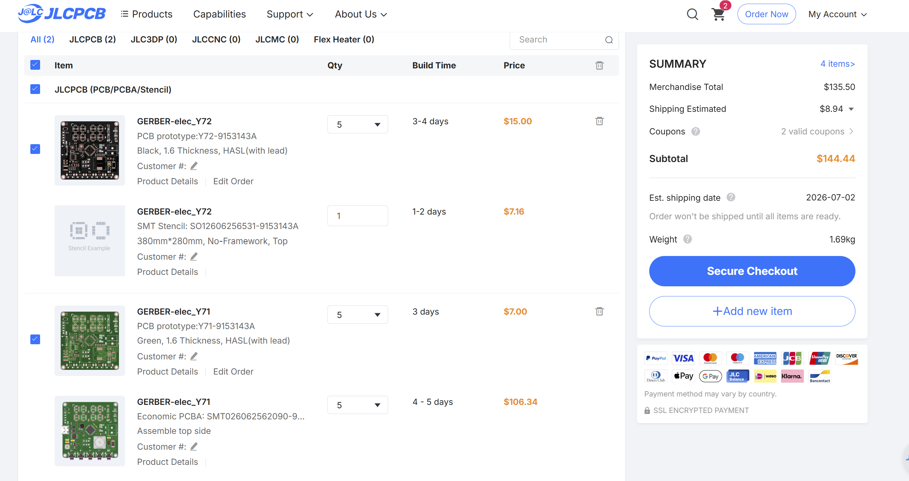
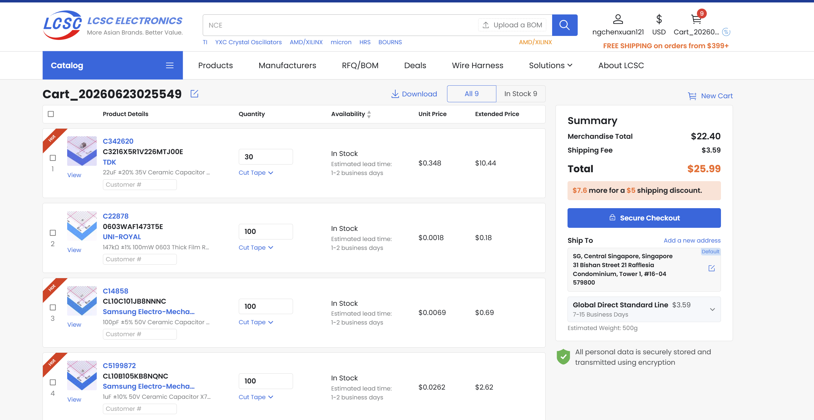

# USB-C-Portable-PSU

> Speedrunning USB-C PD powered variable power supply

The USB-C-Portable-PSU Project is a portable variable power supply designed using KiCad v10.

The PCB was designed with a 4 layer stackup of SIG + PWR / GND / GND / PWR + SIG.

## Objective
This PCB design serves as both an introduction to power electronics design, as well as a practical tool for hobbyist. Theoretical design practices learnt such as minimising trace inductance, buck-boost converter topology and USB-PD design can be tested in real-life conditions; Practice in programming an LED matrix display and experimentation of the STM32 ecosystem can be gained too.

## Features

- Input:

  - Supports USB-C PD up to 28 V / 3 A
- Output:

  - Variable Voltage Output Selection (3.3 V - 20 V)
  - Variable Constant Current Selection (up to 3 A)
  - Variable OCP Current Selection
- 7 Segment display for live voltage and current
- Safety

  - Fault detection for USB-C PD
  - Fault detection for buck/boost converter
  - Temperature monitoring using thermistor
- ST-LINK programming header
- Exposed UART and I2C pins

## File Structure

- [elec/](elec/) - PCB Design Files (KiCad v10)

  - [pcb.pdf](elec/pcb.pdf) - PCB layout reference file
  - [schematics.pdf](elec/schematics.pdf) - PCB schematics reference file
  - [jlcpcb/production_files/](elec/jlcpcb/production_files) - Production files for JLCPCB. Includes BOM, CPL, Gerber files
- [media/](media/) - Images used in this README.md file
- [prod/](prod) - Miscellaneous production files
- [STM32G030K8T6/](STM32G030K8T6/) - STM32CubeMX Configuration file
- [LICENSE](LICENSE), [LICENSES/](LICENSES/) - License files applicable to this project

## Manufacturing Notes

The design is intended to be manufactured using JLCPCB, with F.Cu assembled by JLCPCB and B.Cu hand-soldered to save on cost.

As of 2026-06-23, it is designed to be used without an enclosure.

## Bill of Materials

### Cost Summary

| Item                     | Supplier / Method | Cost (USD) | Notes                            |
| ------------------------ | ----------------- | ---------: | -------------------------------- |
| PCB fabrication          | JLCPCB            |       7.00 | PCB fabrication for MOQ batch    |
| PCBA assembly            | JLCPCB            |     105.87 | Top-layer assembly for MOQ batch |
| Extra black PCB          | JLCPCB            |      15.00 | Same PCB, black, without PCBA    |
| Stencil                  | JLCPCB            |       7.16 | For manual assembly / rework     |
| LCSC parts order         | LCSC              |      22.47 | Loose parts order                |
| **Total excluding LCSC** |                   | **135.03** | JLCPCB-related cost only         |
| **Total including LCSC** |                   | **157.50** | Full listed procurement cost     |

---

### JLCPCB PCBA BOM

Top-layer PCBA only.
Minimum order quantity is **5 PCBs**, so PCBA quantities are shown both **per PCB** and **for 5 PCBs**.

SMD button **SW2 / C115357** is excluded from JLCPCB PCBA.

| Comment              | Designator                                                                                                                                                                                                                                                                                                             | Footprint                                               | LCSC Part # | Qty / PCB | Total Qty for 5 PCBs |
| -------------------- | ---------------------------------------------------------------------------------------------------------------------------------------------------------------------------------------------------------------------------------------------------------------------------------------------------------------------- | ------------------------------------------------------- | ----------- | --------: | -------------------: |
| 0.1uF                | C10, C2, C20, C21, C6, C7, C8, C9                                                                                                                                                                                                                                                                                      | C_0603_1608Metric                                       | C14663      |         8 |                   40 |
| 0R                   | R33                                                                                                                                                                                                                                                                                                                    | R_0603_1608Metric                                       | C21189      |         1 |                    5 |
| 100k                 | R15, R16, R9                                                                                                                                                                                                                                                                                                           | R_0603_1608Metric                                       | C25803      |         3 |                   15 |
| 100pF                | C18                                                                                                                                                                                                                                                                                                                    | C_0603_1608Metric                                       | C14858      |         1 |                    5 |
| 10pF                 | C5                                                                                                                                                                                                                                                                                                                     | C_0603_1608Metric                                       | C1634       |         1 |                    5 |
| 10uF                 | C12                                                                                                                                                                                                                                                                                                                    | C_1206_3216Metric                                       | C13585      |         1 |                    5 |
| 147k                 | R20                                                                                                                                                                                                                                                                                                                    | R_0603_1608Metric                                       | C22878      |         1 |                    5 |
| 15m                  | R17                                                                                                                                                                                                                                                                                                                    | R_2512_6332Metric                                       | C459682     |         1 |                    5 |
| 1M                   | R7, R8                                                                                                                                                                                                                                                                                                                 | R_0603_1608Metric                                       | C22935      |         2 |                   10 |
| 1k                   | R26, R27, R28, R32, R34, R35, R36                                                                                                                                                                                                                                                                                      | R_0603_1608Metric                                       | C21190      |         7 |                   35 |
| 1uF                  | C19                                                                                                                                                                                                                                                                                                                    | C_0603_1608Metric                                       | C15849      |         1 |                    5 |
| 20k                  | R1, R11, R14, R18, R19, R2, R21, R22, R23, R24, R25, R29, R3, R30, R31, R37, R38, R39, R4, R5                                                                                                                                                                                                                          | R_0603_1608Metric                                       | C4184       |        20 |                  100 |
| 2k2                  | R12, R13, R6                                                                                                                                                                                                                                                                                                           | R_0603_1608Metric                                       | C4190       |         3 |                   15 |
| 4.7uH                | L2                                                                                                                                                                                                                                                                                                                     | L_12x12mm_H8mm                                          | C24548      |         1 |                    5 |
| 470R                 | R10                                                                                                                                                                                                                                                                                                                    | R_0603_1608Metric                                       | C23179      |         1 |                    5 |
| 47uH                 | L1                                                                                                                                                                                                                                                                                                                     | L_APV_ANR5040                                           | C9392       |         1 |                    5 |
| 4u7                  | C1, C3, C4                                                                                                                                                                                                                                                                                                             | C_1206_3216Metric                                       | C29823      |         3 |                   15 |
| AO4419               | Q1                                                                                                                                                                                                                                                                                                                     | SOIC-8-1EP_3.9x4.9mm_P1.27mm_EP2.29x3mm_ThermalVias     | C29205      |         1 |                    5 |
| Buzzer               | BZ1                                                                                                                                                                                                                                                                                                                    | Buzzer_Murata_PKMCS0909E                                | C391035     |         1 |                    5 |
| D_Zener              | D1                                                                                                                                                                                                                                                                                                                     | D_SOD-123                                               | C2103       |         1 |                    5 |
| HUSB238A-xxxxx-QN16R | U1                                                                                                                                                                                                                                                                                                                     | WQFN-16-1EP_3x3mm_P0.5mm_EP1.75x1.75mm                  | C24833806   |         1 |                    5 |
| IS31FL3731-QF        | U6                                                                                                                                                                                                                                                                                                                     | QFN-28-1EP_4x4mm_P0.4mm_EP2.3x2.3mm                     | C191206     |         1 |                    5 |
| LED                  | D10, D11, D12, D13, D14, D15, D16, D17, D18, D19, D2, D20, D21, D22, D23, D24, D25, D26, D27, D28, D29, D3, D30, D31, D32, D33, D34, D35, D36, D37, D38, D39, D4, D40, D41, D42, D43, D44, D45, D46, D47, D48, D49, D5, D50, D51, D52, D53, D54, D55, D56, D57, D58, D59, D6, D60, D61, D62, D63, D64, D65, D7, D8, D9 | LED_0603_1608Metric                                     | C2286       |        64 |                  320 |
| STM32G030K8T6        | U3                                                                                                                                                                                                                                                                                                                     | LQFP-32_7x7mm_P0.8mm                                    | C431631     |         1 |                    5 |
| SW_Push              | SW3, SW4, SW5, SW6, SW7                                                                                                                                                                                                                                                                                                | SW_Tactile_SPST_Angled_PTS645Vx58-2LFS                  | C86476      |         5 |                   25 |
| SY8303AIC            | U2                                                                                                                                                                                                                                                                                                                     | TSOT_303AIC_SGY                                         | C97054      |         1 |                    5 |
| TPS55289RYQR         | U4                                                                                                                                                                                                                                                                                                                     | VREG_TPS55289RYQR                                       | C5942077    |         1 |                    5 |
| Thermistor_NTC       | TH1                                                                                                                                                                                                                                                                                                                    | R_0603_1608Metric                                       | C13564      |         1 |                    5 |
| USB_C_Receptacle     | J1                                                                                                                                                                                                                                                                                                                     | USB_C_Receptacle_GCT_USB4105-xx-A_16P_TopMnt_Horizontal | C5178539    |         1 |                    5 |

**JLCPCB PCBA placed quantity:** 135 components per PCB
**Total placed components for MOQ 5:** 675 components

---

### Excluded from JLCPCB PCBA

| Comment | Designator | Footprint  | LCSC Part # | Qty / PCB | Total Qty for 5 PCBs | Reason              |
| ------- | ---------- | ---------- | ----------- | --------: | -------------------: | ------------------- |
| SW_Push | SW2        | SKRKAEE020 | C115357     |         1 |                    5 | Excluded SMD button |

---

### LCSC Separate Purchase / Spare Parts

These parts are purchased separately from LCSC as loose parts, including spare parts, rework parts, and parts excluded from JLCPCB PCBA.

| LCSC Part # | MPN                 | Manufacturer              | Package        | Description                                         | Qty | Unit Price (USD) | Extended Price (USD) |
| ----------- | ------------------- | ------------------------- | -------------- | --------------------------------------------------- | --: | ---------------: | -------------------: |
| C342620     | C3216X5R1V226MTJ00E | TDK                       | 1206           | 22uF ±20% 35V Ceramic Capacitor X5R 1206            |  30 |           0.3480 |                10.44 |
| C22878      | 0603WAF1473T5E      | UNI-ROYAL                 | 0603           | 147kΩ ±1% 100mW 0603 Thick Film Resistor            | 100 |           0.0018 |                 0.18 |
| C14858      | CL10C101JB8NNNC     | Samsung Electro-Mechanics | 0603           | 100pF ±5% 50V Ceramic Capacitor C0G 0603            | 100 |           0.0069 |                 0.69 |
| C5199872    | CL10B105KB8NQNC     | Samsung Electro-Mechanics | 0603           | 1uF ±10% 50V Ceramic Capacitor X7R 0603             | 100 |           0.0262 |                 2.62 |
| C2906980    | FRC0603F1003TS      | FOJAN                     | 0603           | 100kΩ ±1% 100mW 0603 Thick Film Resistor            | 100 |           0.0021 |                 0.21 |
| C2907011    | FRC0603F2002TS      | FOJAN                     | 0603           | 20kΩ ±1% 100mW 0603 Thick Film Resistor             | 100 |           0.0019 |                 0.19 |
| C1591       | CL10B104KB8NNNC     | Samsung Electro-Mechanics | 0603           | 100nF ±10% 50V Ceramic Capacitor X7R 0603           | 100 |           0.0122 |                 1.22 |
| C391035     | FUET-9018           | FUET                      | SMD, 9x9mm     | Buzzers Passive Piezoelectric 4kHz 65dB SMD, 9x9mm  |  10 |           0.4248 |                 4.25 |
| C115357     | SKRKAEE020          | ALPSALPINE                | SMD, 3.9x2.9mm | Tactile Switch SPST 2mm 3.9mm x 2.9mm Surface Mount |  20 |           0.1333 |                 2.67 |

**LCSC order total:** USD 22.47

---

### Notes

- JLCPCB PCBA is for top-layer assembly only.
- JLCPCB's PCBA minimum order quantity is 5 PCBs, so PCBA quantities are shown both per PCB and for 5 PCBs.
- The SMD button `SW2 / C115357` is excluded from JLCPCB PCBA and purchased separately from LCSC.
- Loose LCSC parts include spare parts, rework parts, and parts excluded from JLCPCB PCBA.
- The extra black PCB is the same PCB design but ordered without PCBA.
- Stencil cost is included separately.

## License

This project uses multiple licenses:

- Hardware design files, including schematics, PCB layout files, Gerbers, BOM files, pick-and-place files, mechanical CAD files, and enclosure designs: **CERN-OHL-S-2.0**
- Firmware and software source code: **GPL-3.0-only**
- Documentation, images, diagrams, and build instructions: **CC-BY-SA-4.0**

Full license texts are available in the `LICENSES/` directory.

## Contact

Contact the author at [contact@ngchenxuan.com](mailto:contact@ngchenxuan.com) for any enquiries related to this project.
